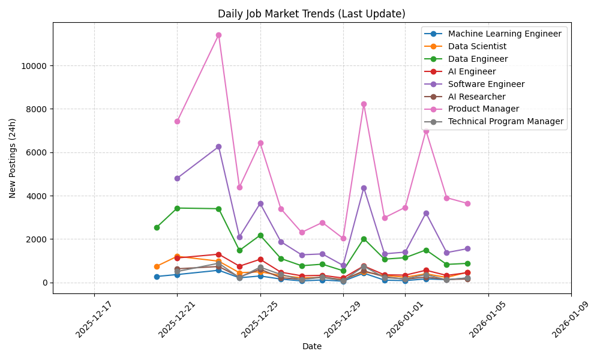

# 📈 Automated Job Market Tracker

A daily data pipeline that tracks the volume of new job postings for Data Science and Machine Learning roles.

## 📊 Live Trends (Last 30 Days)

## 🛠️ How it Works
1. **Scraper:** A Python script hits the Adzuna API every 24 hours.
2. **Analysis:** It calculates the volume of new postings for for several job titles.
3. **Visualization:** Matplotlib generates the trend line above.
4. **Automation:** GitHub Actions handles the scheduling, execution, and committing of new data.

## 📂 Data
The raw historical data is available in [job_market_history.csv](job_market_history.csv).